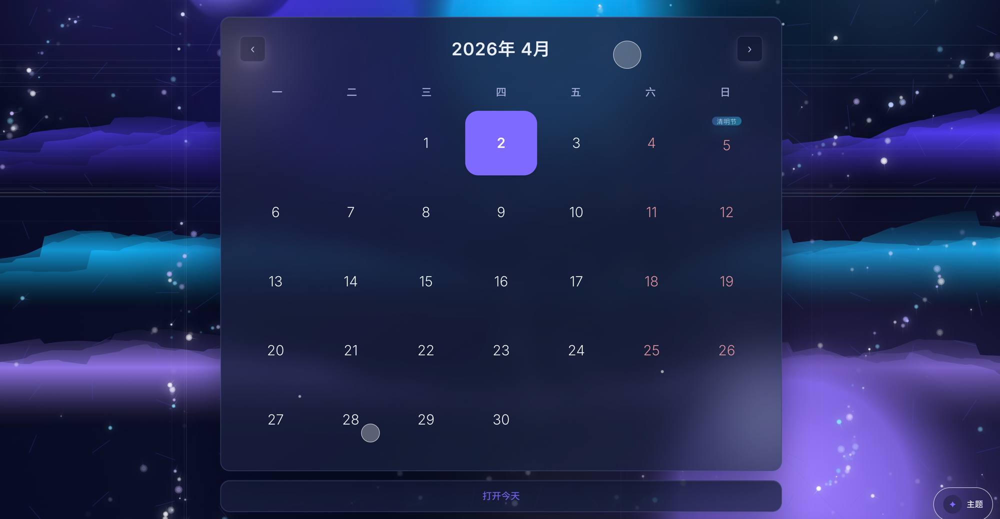
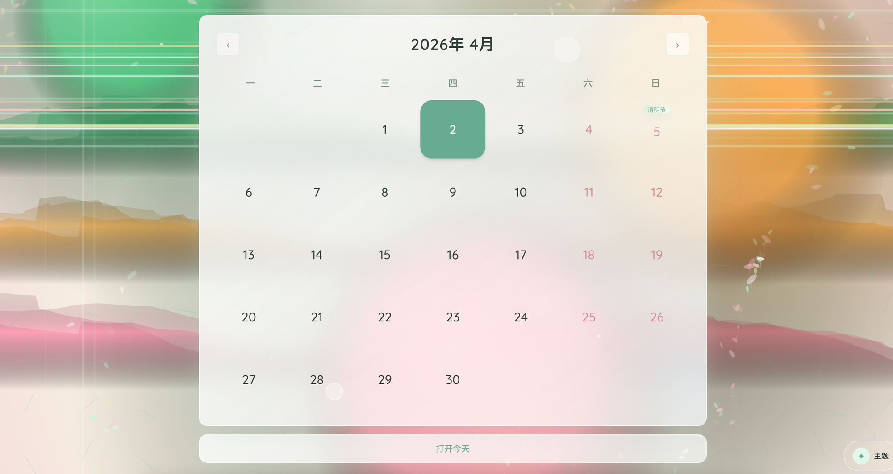
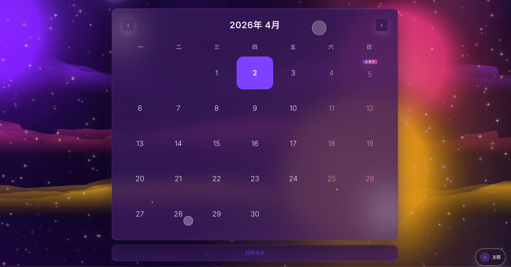
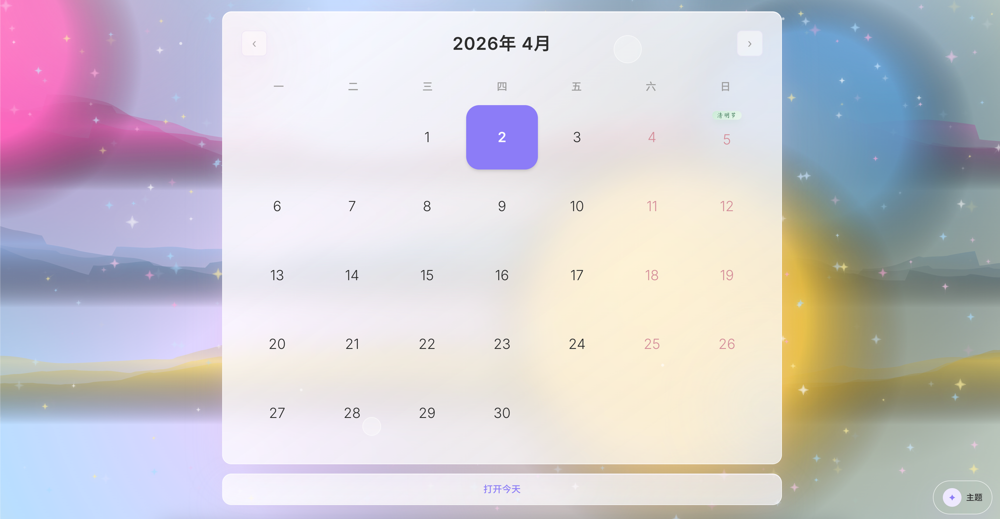
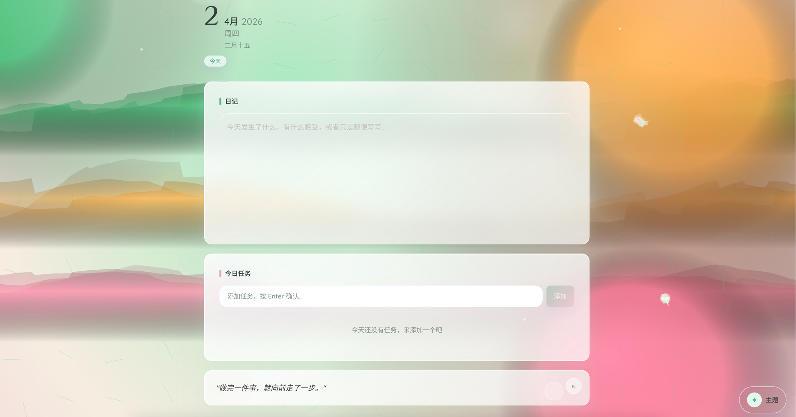
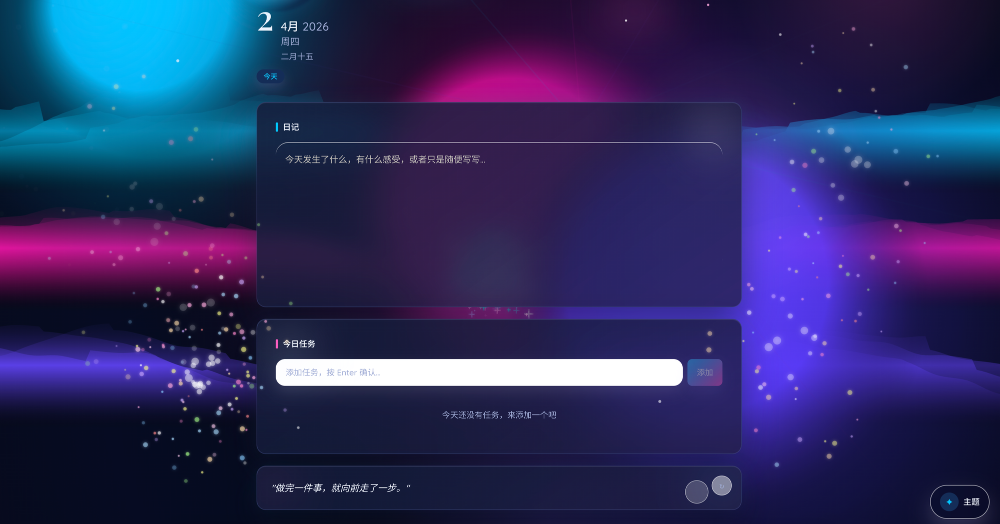

# 彩色手账 · 个人日记

> 把每天的日子，酿成生活的色谱。

一个运行在本地的私人日记 Web 应用，前端 React + TypeScript，后端 FastAPI + SQLite，无需注册、无需云端，数据完全在自己手里。

最大特色是 **7 套动态主题背景**——每个主题都有独立的粒子系统、流光色团和极光动画，点击屏幕任意位置还会触发烟花爆炸效果。

---

## 主题展示

> 所有主题均为实时 Canvas 动画，以下为部分主题截图预览。

### 宇宙深空
深夜蓝 · 极光紫 · 冷银光，星星持续闪烁，极光流动，粒子像星尘。



### 晨雾花园
薄荷绿 · 奶白 · 花瓣粉，花瓣慢慢飘落，清晨雾气流动，光从雾里透出。



### 星云幻境
紫红星尘 · 银河蓝 · 金色流光，星云涌动，金色粒子在深空中漂浮。



### 梦幻渐变
粉蓝奶油金，像漂浮的糖霜云团，四瓣星粒子随气流旋转。



另有 **莓果暮光**（莓果紫 · 蜜桃粉 · 暮色蓝）、**海盐星云**（海盐蓝 · 月光白 · 珊瑚橘）、**星烬霓虹**（电光蓝 · 荧光玫红 · 赛博夜色）共 7 套主题，右下角「主题」按钮一键切换，切换时粒子离散再凝聚。

---

## 日记页面

### 晨雾花园 · 日记


### 星烬霓虹 · 日记


---

## 主要功能

| 功能 | 说明 |
|------|------|
| **每日日记** | 点击日历任意日期进入当天页面，自由书写 |
| **今日任务** | 轻量 Todo，支持添加 / 完成 / 删除 |
| **鼓励卡片** | 每天自动生成一句鼓励语，可接入 AI 生成 |
| **月报总结** | 一键生成本月日记摘要与情绪回顾 |
| **7 套动态主题** | Canvas 粒子 + 极光 + 流光，每套独立个性 |
| **烟花点击** | 鼠标点击任意位置触发烟花爆炸粒子效果 |
| **主题切换动画** | 粒子离散旧主题，在新主题中凝聚重组 |
| **节假日标注** | 日历自动显示中国法定节假日 |
| **本地存储** | SQLite 数据库，数据完全在本地 |

---

## 技术栈

**前端**
- React 18 + TypeScript
- Vite
- Tailwind CSS
- Canvas 2D API（动态背景 · 烟花特效）
- Value Noise + fBm（流体粒子运动）

**后端**
- Python · FastAPI
- SQLite · SQLAlchemy
- Uvicorn

---

## 快速启动

### 环境要求
- Node.js 18+
- Python 3.10+

### 一键启动

```bash
git clone <你的仓库地址>
cd chromadiary
./start.sh
```

启动后打开浏览器访问：

```
http://localhost:5173
```

后端 API 文档：`http://localhost:8000/docs`

按 `Ctrl+C` 停止所有服务。

### 手动启动

**后端：**
```bash
cd backend
python3 -m venv .venv
source .venv/bin/activate
pip install -r requirements.txt
uvicorn main:app --port 8000
```

**前端（新终端）：**
```bash
cd frontend
npm install
npm run dev
```

---

## 项目结构

```
日记网页/
├── frontend/          # React 前端
│   └── src/
│       ├── components/
│       │   ├── ThemeCanvasBackground.tsx  # 动态背景（Canvas 动画）
│       │   ├── ClickFireworks.tsx         # 点击烟花特效
│       │   └── ThemeSwitcher.tsx          # 主题切换面板
│       ├── pages/
│       │   ├── CalendarView.tsx           # 日历主页
│       │   ├── DayDetail.tsx              # 日记详情页
│       │   └── SummaryView.tsx            # 月报页
│       └── theme/
│           └── themes.ts                  # 7 套主题配置
├── backend/           # FastAPI 后端
│   ├── main.py
│   ├── models.py
│   └── routers/
├── start.sh           # 一键启动脚本
└── docs/screenshots/  # 主题截图
```

---

## 使用说明

1. **写日记** — 点击日历上任意日期 → 进入当天 → 在「日记」区域输入文字，失去焦点自动保存
2. **添加任务** — 在「今日任务」输入框输入内容，按 Enter 或点击「添加」
3. **切换主题** — 右下角「✦ 主题」按钮，选择喜欢的主题，支持随机
4. **查看月报** — 顶部「月报」按钮生成当月摘要
5. **烟花彩蛋** — 鼠标点击屏幕任意位置

---

*数据存储在 `backend/data.db`，备份这个文件即可保存所有日记。*
